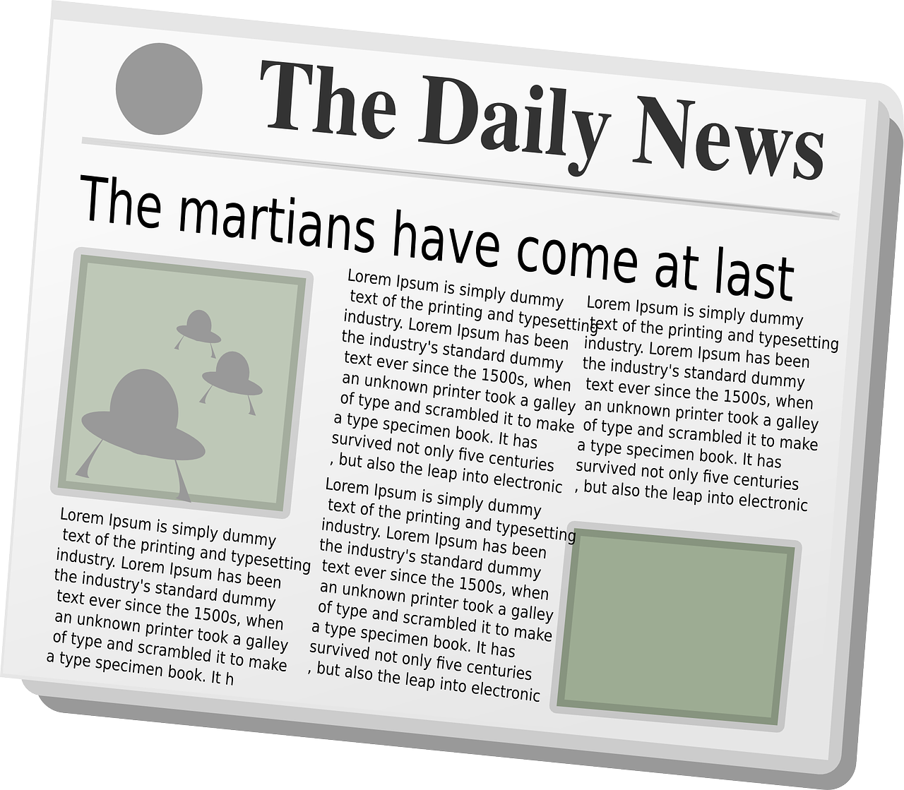

# google-vision-sampler
Code examples for Google Vision API written in Python.

## Description
Example codes has following features:

* Face Detection
* Landmark Detection
* Logo Detection
* Label Detection
* Text Detection
* Safe Search Detection

## Requirement

* Python 3.x
* Credentials

## Setup

To install necessary library, simply use pip:

```bash
pip install google-cloud-vision
```

or,

```bash
pip install -r requirements.txt
```

Next, set up to authenticate with the Cloud Vision API using your project's service account credentials. See the [Vision API Client Libraries](https://cloud.google.com/vision/docs/libraries) for more information. Then, set the GOOGLE_APPLICATION_CREDENTIALS environment variable to point to your downloaded service account credentials:

```bash
export GOOGLE_APPLICATION_CREDENTIALS=/path/to/your/credentials-key.json
```

## Quick Start: Running the Example


### Face Detection

Face Detection demo using FACE_DETECTION feature.


```bash
$ python face_detection.py images/face.jpg
```

### Label Detection

Label Detection demo using LABEL_DETECTION feature.


```bash
$ python label_detection.py images/label.jpg
Found label: laptop
```

### Landmark Detection

Landmark Detection demo using LANDMARK_DETECTION feature.


```bash
$ python landmark_detection.py images/landmark.jpg
Found landmark: Statue of Liberty
```

### Logo Detection

Logo Detection demo using LOGO_DETECTION feature.


```bash
$ python logo_detection.py images/logo.jpg
Found logo: Starbucks
```

### Text Detection

Text Detection demo using TEXT_DETECTION feature.



```bash
$ python text_detection.py images/text.png
Found text: The Daily News
The martians have come at Lorem Ipsum is simply Lorem Ipsum is simply dummy
text of the printing and of the printing and typesetting
the industry's standard has been industry. has been
text since dummy the industry's standard dummy
1500s, when text since 1500s, when
a an unknown printer took a galley an unknown printer took a galley
of type and scrambled it to make of and scrambled it to make
type specimen book. It has
...
```

## Image Sizing
To enable accurate image detection within the Google Cloud Vision API, images should generally be a minimum of 640 x 480 pixels (about 300k pixels). Full details for different types of Vision API Feature requests are shown below:

| Vision API Feature | Recommended Size | Notes |
|---|---|---|
| FACE_DETECTION | 1600 x 1200 | Distance between eyes is most important |
| LANDMARK_DETECTION | 640 x 480 |   |
| LOGO_DETECTION | 640 x 480 |   |
| LABEL_DETECTION | 640 x 480 |   |
| TEXT_DETECTION | 1024 x 768 | OCR requires more resolution to detect characters |
| SAFE_SEARCH_DETECTION | 640 x 480 |   |

## Licence

[MIT](https://github.com/Hironsan/google-vision-sampler/blob/master/LICENSE)

## Author

[Hironsan](https://github.com/Hironsan)